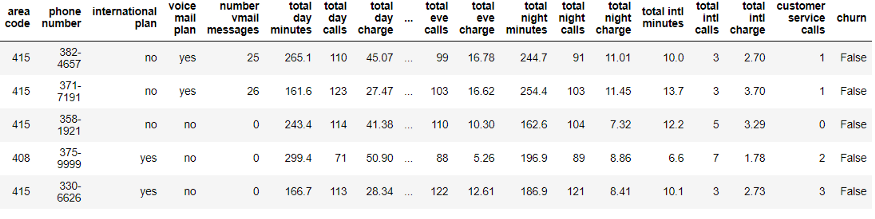
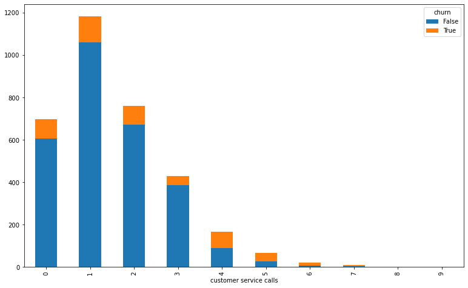
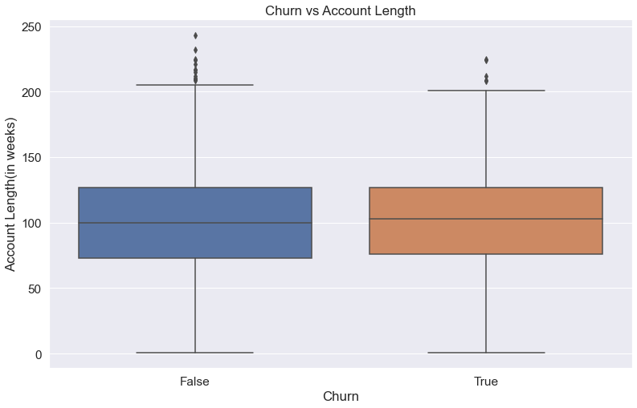
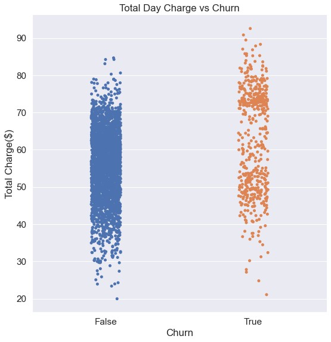
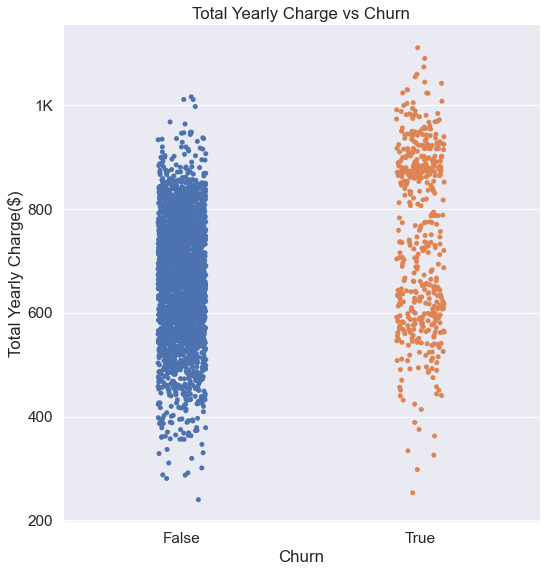
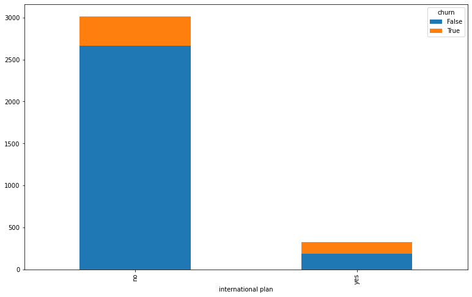
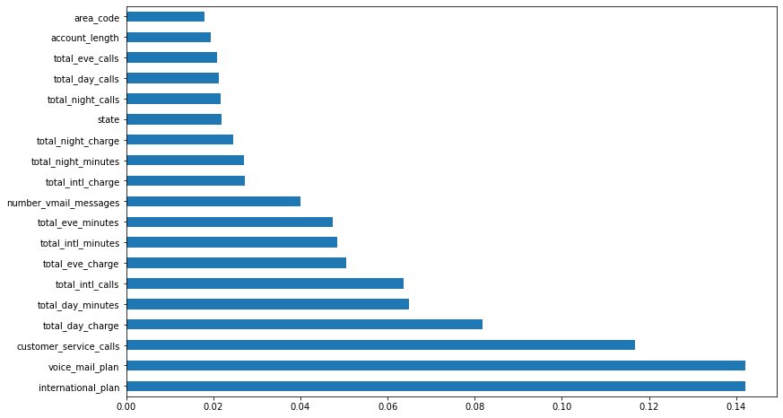

# Telecom Churn Analysis.
* [Blog Link](https://medium.com/@saifkasmani84/telecom-churn-analysis-8f982807574f)
* [Video Recording](PresentationVid/presvid.mp4)
* [Presentation](Presentation/presentation.pdf)

# Table Of Contents
* [Purpose](#purpose)
* [Data Description](#data-description)
* [Data Cleaning](#data-cleaning)
* [Questions](#questions)
* [Model](#model)
* [Recommendations](#recommendations)
* [Future Work](#future-work)

## Purpose
Predicting churn for a telecom company so it can can effectively focus a customer retention marketing program (e.g. a special offer) or improve certain aspects based on the model to the subset of clients which are most likely to change their carrier. Therefore, the “churn” column is chosen as target and the following predictive analysis is a supervised classification problem.

## What is Churn and why is it important?
The churn rate is the percentage of subscribers to a service who discontinue their subscriptions to the service within a given time period.
For a company to expand its clientele, its growth rate, as measured by the number of new customers, must exceed its churn rate.

Churn is important because it directly affects your service’s profitability. It is common to assume that the profitability of a service is directly related to the growth of its customer base. That might lead business owners to imply that in order to grow their customer base, the rate of acquiring new customers must exceed the churn rate.

## Data Description
Churn in telecom’s dataset which can be found here — https://www.kaggle.com/becksddf/churn-in-telecoms-dataset

## Data Cleaning
All data was cleaned on [this notebook](Notebooks/Preprocessing.ipynb).
 
In the Data Cleaning notebook we prepared our data to be exported for EDA. Removed unwanted columns and converted respective objects. Formatted it as the desired data types needed for plotting and analysis. The file which is used as the primary csv file after cleaning is [churn.csv](Data/churn.csv)

 * We can see that the columns “state”, “international plan”, “voice mail plan” and “churn” have String values. The latter three seem to have just the values “yes” or “no” and are therefore converted to 1 and 0 respectively.
* The “state” column is converted using the LabelEncoder, which replaces each unique label with a unique integer. In this case, a label encode is used instead of dummy variables because of the many distinct values.
* The “phone number” column is removed, because every customer has its own phone number.
* We can see that we have clearly more samples for customers without churn than for customers with churn. So we have a class imbalance for the target variable which could lead to predictive models which are biased towards the majority (i.e. no churn). In order to deal with this issue we will investigate into the use of oversampling when building the models.

## Questions

 Question 1: Do we see an increase in churn rate with more customer service calls?

### EDA

We see an increase in customer churn rate in increasing number of customer service calls made by the customer.
Some might be repeatedly calling for a fix and switched carriers when their issue was not fixed.
Was there an issue with service quality, coverage etc?
It will be interesting to investigate the data on what type of issues the customers called in for in the customer service calls.

 Question 2: How does account length matter?

### EDA

Significant considerable maximum churn is observed in account length bracket of 75 to about 100 weeks.

 Question 3: Monthly/Yearly Charge vs Churn Rate?

### EDA

In this we see that the customers who churned were paying more per month then the customers who did not churn. They were paying about 10–15 dollars extra a month than the customers who did not churn. Churn rate increased with increase in Total Charge in a day. Approximately they paid around 100–150 more than the customers who did not churn.

 Question 4:  How does international plan affect churn rate?

### EDA

We can see only a few customers with international plan. But in those few, there is a significant churn rate — slightly less than 50%.
In the data we were given, that may imply that the customers who left were not happy with the international plan charges.

## [Model](Notebooks/Models.ipynb)

The following models were tried with this dataset:
* LogisticRegression
* XGBClassifier
* MultinomialNB
* AdaBoostClassifier
* KNeighborsClassifier
* GradientBoostingClassifier
* ExtraTreesClassifier
* DecisionTreeClassifier
Out of all these the best performers were GradientBoostingClassifier and XGBClassifier.

I chose XGBoost Classifier as my final model and here are the feature importances of the model.

From these feature importances i took the 4 most important features which are:
* International Plan
* Voice Mail Plan
* Customer Service Calls
* Total Day Charge

## Recommendations
* One of the most important predictors for the Model is the number of customer service calls. This might imply that the company should improve its customer service and solve the issues of customers calling in repeatedly.
* Another important feature is the total day minutes and the total day charge. The company could try to either lower its charge per minute for clients, which have many day minutes or it could offer flat rates for calls.
* I would suggest the Telecom company to present special offers according to the customers life-time value(Account-Length).
* Follow-up with customers using international plan since almost 50% of the total customers with the plan left. Investigate the reason.

## Future Work
* Get data on payment methods.
* See if churn rate is affected by special promotions of other carriers.
* Internet plans.
* Contract based plans ( Month-to-Month, One Year, Two Year)
* Type of issue information in customer service calls.
* Survival Analysis ( The Cox Proportional Hazards Model ) — The Cox PH Model is a regression based model that analyses the features of a dataset with regards to how long a or customer survives. It is called the Proportional Hazards model as it describes how each feature proportionally increases risk over the baseline survival rate for a cohort.

